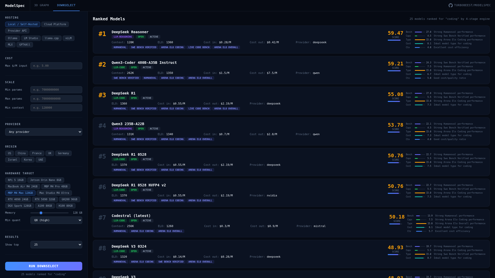
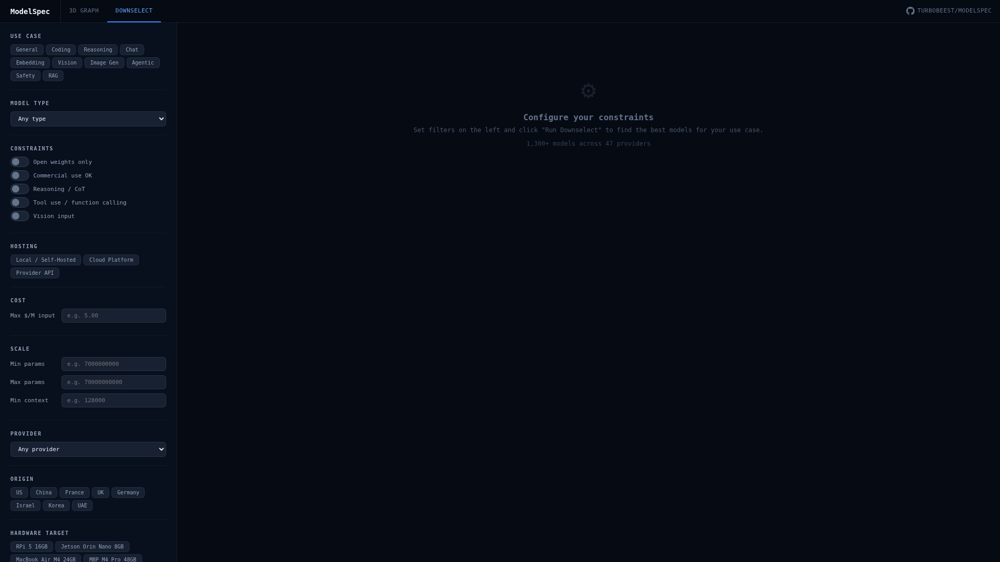
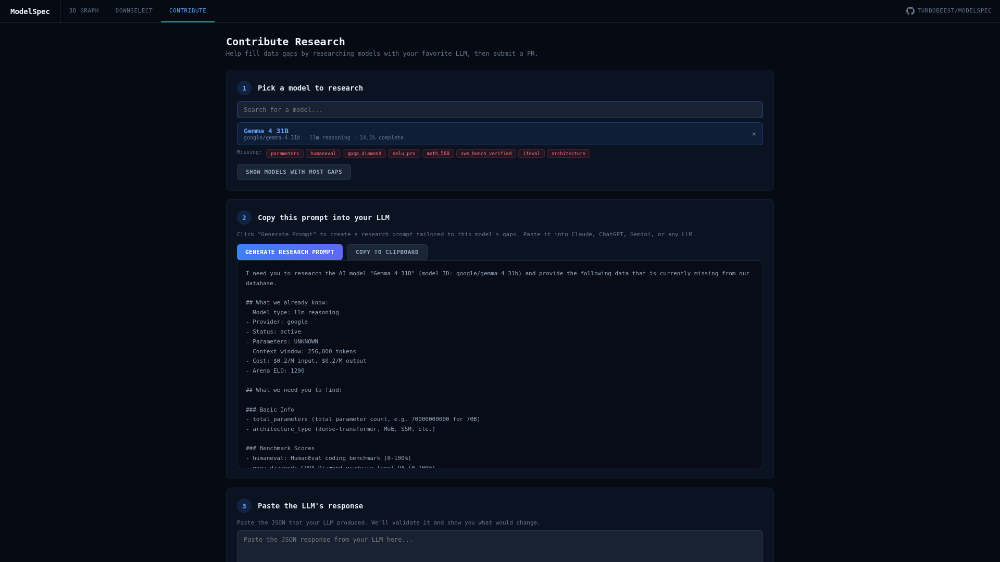

<p align="center">


    Catalog every AI model. Map it to your hardware. Rank what's best for you.
  </p>
  <p align="center">
    <a href="#3d-knowledge-graph">3D Graph</a> &middot;
    <a href="#downselect-wizard">Downselect</a> &middot;
    <a href="#cli">CLI</a> &middot;
    <a href="#contribute">Contribute</a> &middot;
    <a href="#api">API</a>
  </p>
</p>

---

## What is this?

There's no single place that answers: *"What's the best model I can actually run on my hardware, for my use case, that my organization is allowed to use?"*

ModelSpec answers that question by synthesizing data from HuggingFace, models.dev, LMArena, Artificial Analysis, and community research into a **FalkorDB knowledge graph** with a universal schema covering every model type.

**Right now:**
- **1,140+ model cards** across **47 providers** (OpenAI, Anthropic, Google, Meta, Mistral, NVIDIA, DeepSeek, Qwen, and 39 more)
- **8,400+ graph edges** connecting models to providers, benchmarks, capabilities, platforms, licenses, and competitors
- **15 model types**: LLM-Chat, LLM-Reasoning, LLM-Code, VLM, Embedding, Image Gen, Safety Classifier, Reward Model, Reranker, ASR, TTS, and more
- **750-field universal schema** per model — one template for all model types
- **4-stage ranking engine** with 9 use-case profiles and hardware-aware speed estimation

---

## 3D Knowledge Graph

An interactive 3D force-directed visualization of the entire AI model landscape. Each model type has a unique **3moticon** — a programmatic 3D mesh icon built with Three.js.

<p align="center">

</p>

**Features:**
- **8 edge views**: Provider, Lineage, Competition, Platforms, Benchmarks, Capabilities, Licensing, Tags
- **15 3moticon shapes**: Speech bubble (chat), lightbulb (reasoning), code brackets (code), eye (VLM), rings (embedding), palette (image gen), shield (safety), star (reward), and more
- **Click any node** for a detail panel with properties and navigable relationships
- **Search** with instant results and camera focus
- Node size scales by parameter count, color by model type

<p align="center">

  
  

</p>

---

## Downselect Wizard

Tell it what you need. It tells you which model to use.

<p align="center">
  
</p>

**Filter by:**
- **Use case**: Coding, Reasoning, Chat, Embedding, Vision, Agentic, RAG, Safety
- **Hosting**: Local (self-hosted), Cloud Platform (AWS, Groq, Together), Provider API (OpenAI, Anthropic)
- **Hardware**: 14 presets from Raspberry Pi 5 to B200, with MIG partition support
- **Constraints**: Open weights, origin country, max cost, min context, parameter bounds
- **Capabilities**: Reasoning, tool use, vision

**The ranking engine:**
1. **Filters** by hard constraints (memory fit, licensing, origin)
2. **Scores** across benchmarks, capabilities, cost efficiency, and speed
3. **Ranks** with tie-breaking by Arena ELO and parameter count
4. **Explains** every score with per-dimension breakdowns

<p align="center">
  
</p>

Select a GPU preset, optionally apply a MIG partition (1/2, 1/3, 1/4, 1/7), and the sliders auto-adjust memory, bandwidth, compute, and recommended quantization. The ranking engine estimates tokens/sec and filters out models that won't run at usable speed.

---

## CLI

```bash
pip install -e ".[dev]"
```

```bash
# Database overview
modelspec stats

# Search with filters
modelspec search --type llm-code --open-weights

# Model detail
modelspec info anthropic/claude-opus-4-6

# Side-by-side comparison
modelspec compare anthropic/claude-opus-4-6 openai/o3 google/gemini-2-5-pro

# Ranked recommendations
modelspec rank --use-case coding --top 10

# Hardware compatibility
modelspec hardware macbook_air_m4_24gb

# Find data gaps
modelspec gaps --top 20

# Auto-research from HuggingFace
modelspec research google/gemma-4-31b-it

# Validate all cards
modelspec validate

# Fork, branch, and PR your changes
modelspec contribute
```

---

## Contribute

ModelSpec is community-driven. Three ways to contribute research:

### 1. Web UI (easiest)

Visit `/contribute` in the web UI. Pick a model with data gaps, generate a research prompt, paste it into your favorite LLM (Claude, ChatGPT, Gemini), then paste the results back. The UI validates and submits a GitHub issue.

<p align="center">
  
</p>

### 2. CLI (for power users)

```bash
modelspec gaps --top 10          # Find what needs research
modelspec research <model_id>   # Auto-fetch from HuggingFace
modelspec contribute             # Open a PR with your changes
```

### 3. Direct YAML editing

Model cards live in `models/{provider}/{model-slug}.md` as YAML frontmatter + Markdown. Edit directly and submit a PR — GitHub Actions will validate the schema and report what changed.

---

## API

FastAPI backend with full Swagger docs at `/docs`.

```bash
# Start the API
docker compose up -d  # FalkorDB
pip install -e ".[dev]"
python scripts/ingest_all.py
uvicorn api.main:app --port 8000
```

**Endpoints:**
| Method | Path | Description |
|--------|------|-------------|
| GET | `/api/v1/models` | List models (paginated, filterable) |
| GET | `/api/v1/models/{id}` | Full model card as JSON |
| GET | `/api/v1/graph?view=provider` | Graph data for 3D visualization |
| GET | `/api/v1/search?q=gemma` | Search by name, provider, type |
| GET | `/api/v1/stats` | Database statistics |
| POST | `/api/v1/rank` | Ranking with use-case profiles |
| GET | `/api/v1/views` | Available edge views |
| GET | `/api/v1/node/{id}` | Node detail with relationships |
| GET | `/graph` | 3D knowledge graph UI |
| GET | `/downselect` | Downselect wizard UI |
| GET | `/contribute` | Community contribution UI |

---

## Architecture

```
    /graph ─────┐
    /downselect ┤──▶ FastAPI ──▶ FalkorDB Knowledge Graph
    /contribute ┤       │              │
    CLI ────────┘       │        1,469 nodes
                        │        8,472 edges
                  Ranking Engine       │
                  (4-stage pipeline)   │
                        │        Model Card Repo
                        │        (1,140 YAML files)
                        │              │
                  Scrapers ────────────┘
                  (HuggingFace, models.dev, AA)
```

**Tech stack:**
- **Graph DB**: FalkorDB (Redis-compatible, OpenCypher)
- **Backend**: Python 3.11+, FastAPI, Pydantic v2
- **3D Viz**: Three.js via 3d-force-graph (zero build step)
- **CLI**: Typer + Rich
- **Schema**: 750-field Pydantic model with YAML serialization

---

## Schema

Every model gets a universal YAML+Markdown card with 15 sections:

| Section | Fields | What it covers |
|---------|--------|---------------|
| Identity | 13 | Name, provider, type, status, release date |
| Architecture | 22 | Parameters, layers, attention, tokenizer |
| Lineage | 16 | Base model, training method, datasets |
| Licensing | 15 | License type, commercial use, origin country |
| Modalities | 60+ | Text, vision, audio, video, embeddings, reranking |
| Capabilities | 50+ | Coding, reasoning, tool use, languages, safety |
| Cost | 17 | Input/output pricing, cache, batch, fine-tuning |
| Availability | 83 | Platform-by-platform availability |
| Benchmarks | 50+ | Arena ELO, HumanEval, GPQA, MMLU, SWE-bench |
| Deployment | 30+ | Hardware profiles, runtimes, quantizations |
| Risk & Governance | 40+ | Bias evaluation, privacy, regulatory |
| Performance | 10 | Latency, throughput, quality/dollar |
| Adoption | 8 | Downloads, likes, community usage |
| Downselect | 14 | Compliance tags, eval status, custom scores |
| Sources | 12 | URLs and freshness tracking |

---

## Quick Start

```bash
git clone https://github.com/turbobeest/modelspec.git
cd modelspec

# Start FalkorDB
docker compose up -d

# Install
python3 -m venv .venv && source .venv/bin/activate
pip install -e ".[dev]"

# Ingest model cards into the graph
python scripts/ingest_all.py

# Start the API + web UI
uvicorn api.main:app --host 0.0.0.0 --port 8000

# Open in browser
# 3D Graph:   http://localhost:8000/graph
# Downselect: http://localhost:8000/downselect
# Contribute: http://localhost:8000/contribute
# API Docs:   http://localhost:8000/docs
```

---

## Logo Prompt

> Generate a logo for "ModelSpec" — a neural network knowledge graph platform. White transparent text on dark background. The "o" in "Model" is replaced by a stylized gear/cog made of interconnected neurons — nodes with synaptic connections forming a gear shape. Clean, technical, minimal. The neural-gear should subtly glow with a blue-indigo gradient (#3b82f6 to #6366f1). Monospace or geometric sans-serif font. Think: the intersection of machine learning and engineering precision.

---

## License

MIT
